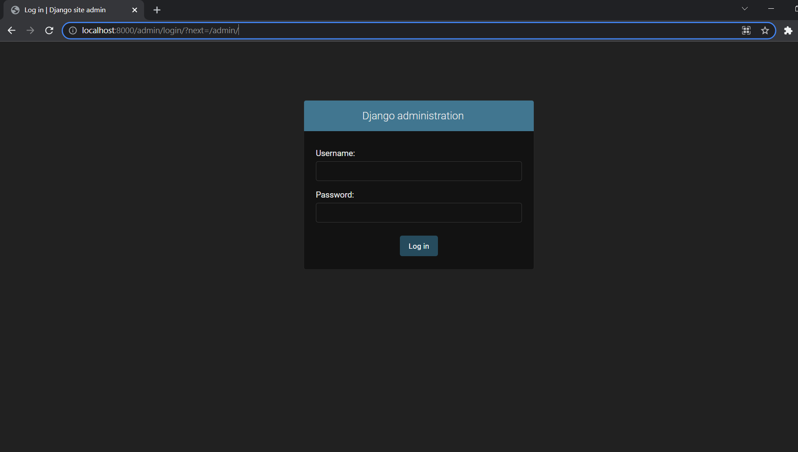
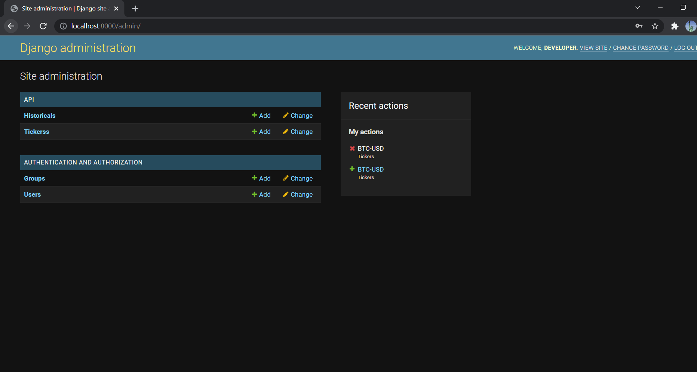
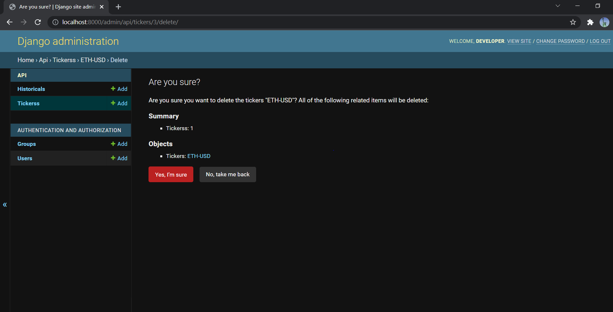
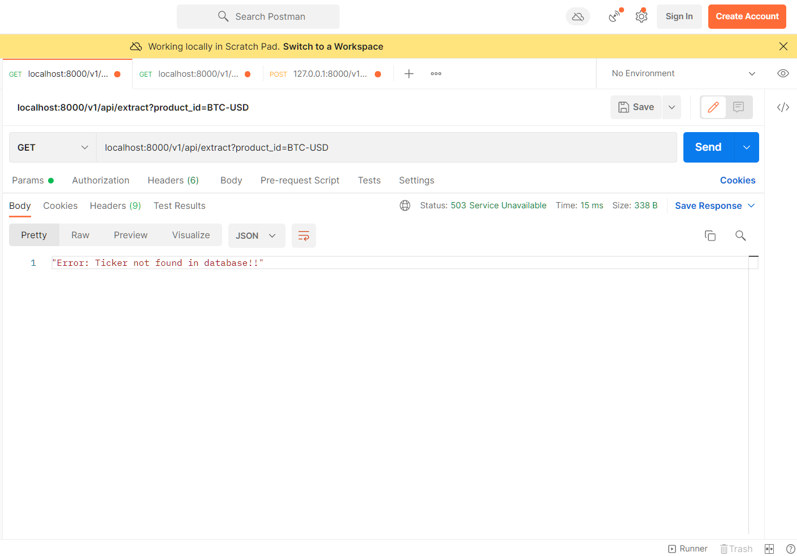
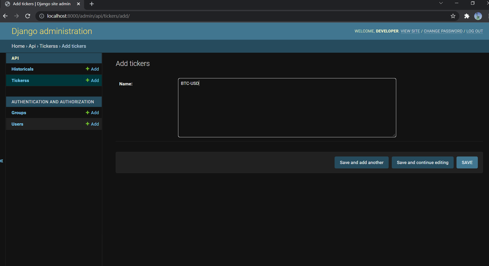
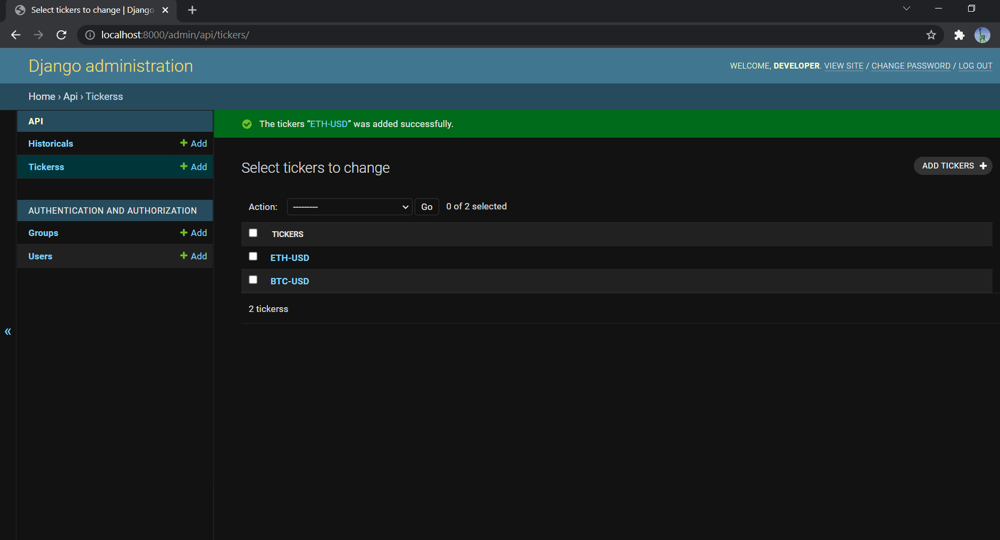
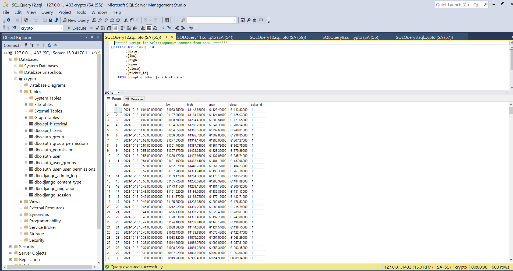
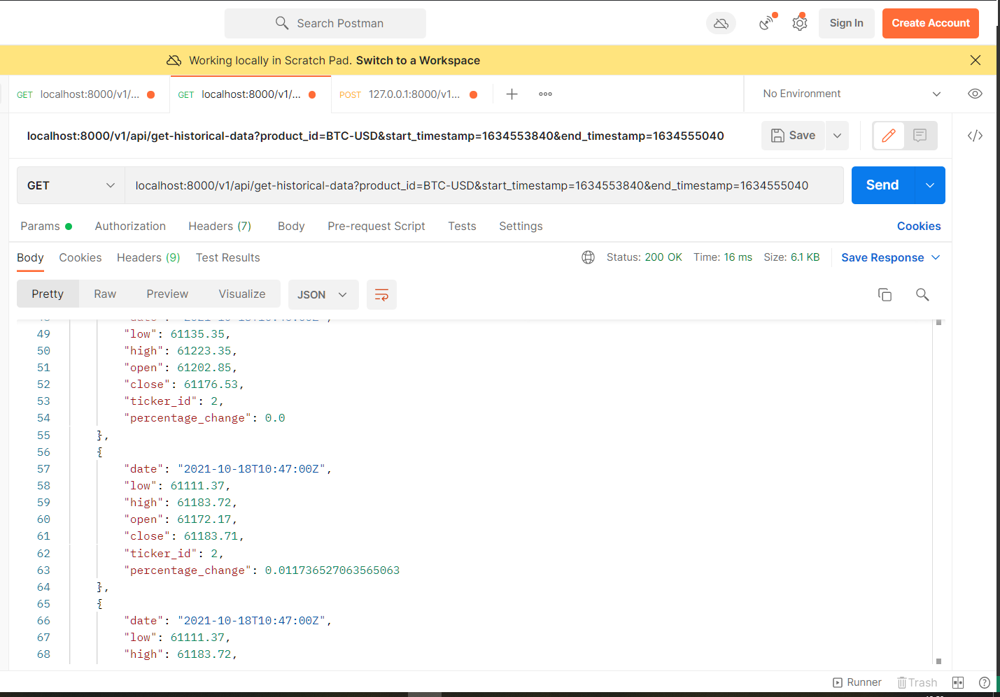
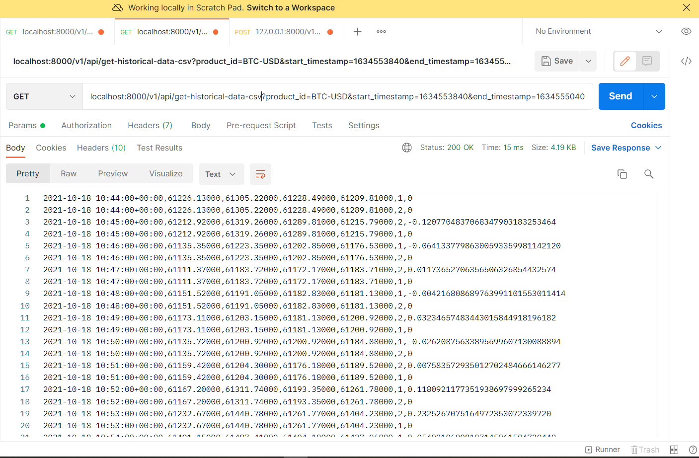

## Instructions to run the project

# Recent changes made in setup files due to some issues faced recenty as mentioned below
Changed Docker image from 3.7 to 3.7.10  

Udated the Dockerfiles  

Updated the docker-compose.yaml file  

Some issues faced during setting up the infra:-  

Issue - https://stackoverflow.com/questions/68846245/failing-installation-of-msodbcsql17  

Issue - https://support.microsoft.com/en-us/topic/                  kb4532432-mssql-conf-tool-fails-if-ipv6-is-disabled-on-the-linux-system-3d7ba7f1-0d0b-0cc6-176f-ee5f7ff0ecea  

# Recommended to run in python virtual env if you wish to run the application locally outside docker(Docker is recommended, please jump to Docker section below)
https://gist.github.com/Geoyi/d9fab4f609e9f75941946be45000632b

# Pre-requiste for running the app natibely without Docker(See below for easy Docker setup)

* Database setup done
* Tables created successfully
* Scripts in project directory

# To run 

# Unix 

```
python3 -m venv venv
``` 
``` 
source venv/bin/activate
``` 
``` 
python3 manage.py runserver
``` 

# Windows

```
python3 -m venv venv
```
```
venv/Scripts/activate
```
``` 
python3 manage.py runserver
``` 

# To run with docker-compose(Recommended)

``` 
docker-compose up --build
``` 

# Upon running docker-compose up --build

* It will create the Database server and the app server
* Create database crypto
* Migrate Historical, Tickers tables from Django models to the db

You can log into the Django admin to see the models, perform CRUD operations  

You can perform the same operations from the APIs. Urls in app/functions/api/urls.py  

http://localhost:8000/admin  

User and Password in the start.sh file at root  




Models  



CRUD operation through Django admin using ORM  



# Some important urls

### To extract and update the database with coinbase APIs response based on product_id
Ex- BTC-USD, ETH-USD, ADA-USD, DOGE-USD etc..  

Make sure you have the tickers updated for corresponding product_id otherwise API will complain about ticker not present  

localhost:8000/v1/api/extract?product_id=BTC-USD  



Add ticker to the DB through admin console  

  

  

Now this will pupulate the database  

  

### To retrieve data from database for a product between a date range in both json and csv formats

localhost:8000/v1/api/get-historical-data?product_id=BTC-USD&start_timestamp=<spoc timestamp>&end_timestamp=<epoc timestamp>  

json response  

  

csv response  

  

### Other endpoints to interact with the models - tickers and historical  

localhost:8000/v1/api/insert-btc-rates  

localhost:8000/v1/api/insert-tickers


-----------------------------------------------------------------------------------------------------------
------------------------------------------------------------------------------------------------------------

## Project Description:
The goal of this exercise is to build an API based project that extracts data from [coinbase API](https://docs.pro.coinbase.com/#get-historic-rates), and saves it in the DB via the API.

### Tasks:
1. Create a REST API to be used as a *communication layer* between the ETL function and the database.

2. Create a python function (under `/app/functions/extract`) that loads BTC data from [coinbase API](https://docs.pro.coinbase.com/#get-historic-rates) and inserts into the database (hitorical table) via the API (created in step 1).

3. In the API, create /GET enpoint for *historical* resource. This endpoint should return historical data by date range. Along with columns in the table include an additional column, daily % change in the resource.
  Formula: daily % change = ((last_price - prev_price) / prev_price) * 100
  where last_price = T close price
		prev_price = T - 1 close price

4. This /GET endpoint should be able to support both json and csv response types.

## Project Structure

### DB schema
**tickers Table**
id  | name
  ------------- | -------------
  1  | BTC-USD

**historical Table**
ticker_id | dt  | open | high | low | close
 ------------- |  ------------- | ------------- | ------------- | ------------- | -------------
  1 | 2020-01-14  | 12.01 | 12.56 | 11.8 | 12.45


## Setting up the DB:
Feel free to use the sql scripts provided under /app/init_db folder as a starting point.
Alternatively we encourage the candidates to set up data models using ORM.

To initialise the db use:
    ./init_db/init-db.sh

And to test the db connection:
    python init_db/test_db.py

## Connecting to DB:
(once docker-compose is up, you can access SQL DB)
In order to view the database you can use SQL Management Studio.

Hostname: **(local)**

Username: **sa**

Password: Check `docker-compose.yaml`